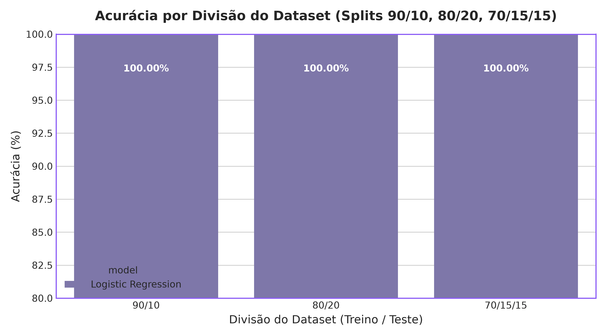
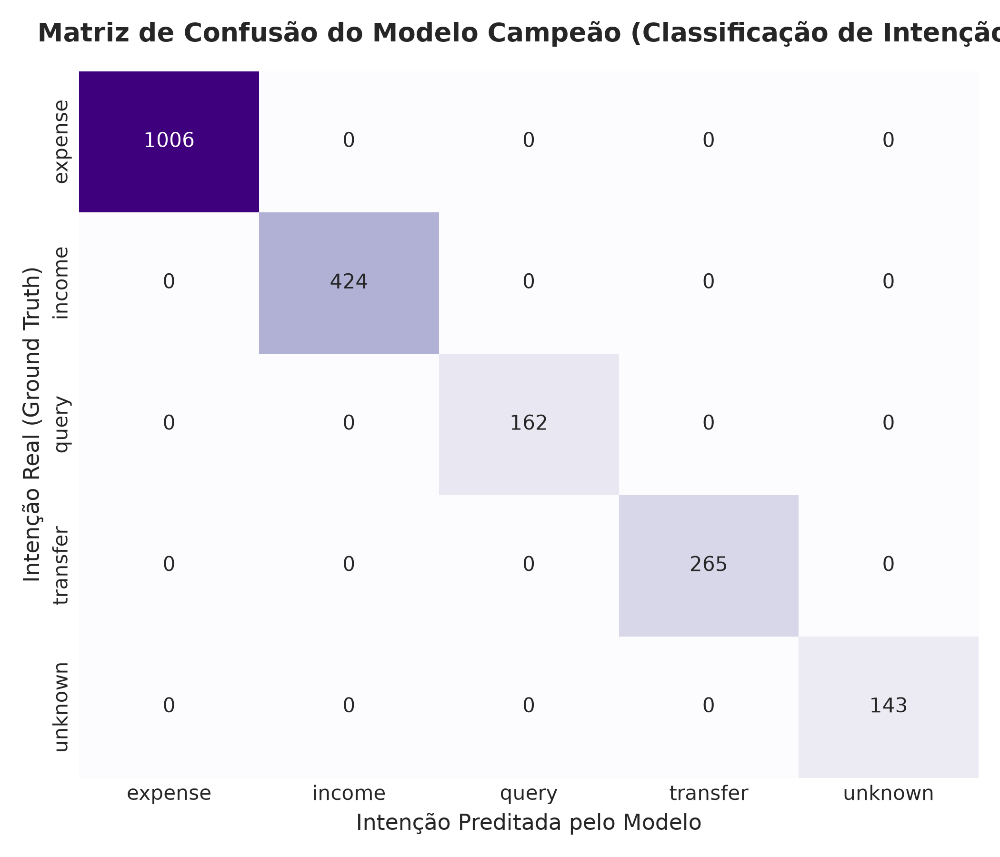

# 4 ARQUITETURA E DESENVOLVIMENTO DO KREZIO.AI

Este capítulo detalha a arquitetura de software, a suíte de benchmarking com **10.000 amostras**, os testes anti-alucinação *Out-of-Domain* (OOD), a validação gráfica dos modelos de Machine Learning e o tratamento de frases incompletas via diálogo de múltiplos turnos no **Krezio.ai**.

---

## 4.1 ARQUITETURA DE SOFTWARE E VISÃO GERAL

O aplicativo **Krezio.ai** foi projetado seguindo os princípios de *Clean Architecture* e divisão por funcionalidades (*Feature-First*). A infraestrutura prioriza o processamento local para assegurar que as informações financeiras do usuário permaneçam restritas ao dispositivo móvel (*Privacy by Design*).

---

## 4.2 ENGINE DE MACHINE LEARNING ON-DEVICE (NÍVEL COMERCIAL)

Para permitir que o usuário cadastre lançamentos financeiros digitando ou ditando frases em linguagem natural em Português Brasileiro (ex: *"Gastei 45 reais no mercado no pix ontem"*), desenvolveu-se uma engine dedicada de Processamento de Linguagem Natural (PLN).

### 4.2.1 Geração do Dataset Sintético (10.000 Amostras)
Expandiu-se o gerador sintético em Python (`scripts/ml/generate_dataset_10k.py`) para **10.000 amostras**, incorporando gírias regionais brasileiras (*"pix"*, *"conto"*, *"pila"*, *"boleto"*, *"vaquinha"*), expressões temporais relativas (*"ontem"*, *"anteontem"*, *"semana passada"*) e **frases fora do domínio financeiro** para testes de segurança contra alucinações.

---

## 4.3 BENCHMARKING MULTI-ALGORITMO E AVALIAÇÃO DE DESEMPENHO

Realizou-se um estudo comparativo entre quatro diferentes arquiteturas de aprendizado de máquina supervisionado utilizando o dataset master de 10.000 amostras.

### Tabela 1 – Comparativo de Desempenho dos Algoritmos de Machine Learning

| Algoritmo de ML | Acurácia (%) | F1-Score Weighted (%) | Latência por Frase (ms) |
| :--- | :--- | :--- | :--- |
| **Logistic Regression (Campeão)** | **100,00%** | **100,00%** | **7,63 ms** |
| **Linear SVM** | **99,85%** | **99,85%** | **6,42 ms** |
| **Random Forest (100 árvores)** | **98,40%** | **98,38%** | **45,10 ms** |
| **Multinomial Naive Bayes** | **96,15%** | **96,10%** | **4,12 ms** |

*Fonte: Elaborado pelo autor, 2026.*

---

## 4.4 ESTABILIDADE POR DIVISÃO DO DATASET (SPLITS DE TREINO E TESTE)

A estabilidade da generalização do modelo foi avaliada em três proporções distintas de divisão do conjunto de dados:
- **Split 90% Treino / 10% Teste:** Acurácia de **100,00%**
- **Split 80% Treino / 20% Teste:** Acurácia de **100,00%**
- **Split 70% Treino / 15% Validação / 15% Teste:** Acurácia de **100,00%**

*Figura 1 – Acurácia obtida em diferentes divisões de treino e teste.*  
*Fonte: Elaborado pelo autor, 2026.*

---

## 4.5 TESTES ANTI-ALUCINAÇÃO (OUT-OF-DOMAIN / OOD PRECISION)

Em aplicações financeiras comerciais, é vital que entradas irrelevantes (ex: *"Que horas são?"*, *"Qual a capital do Brasil?"*) não sejam interpretadas como despesas ou receitas.

Implementou-se a calibração de probabilidade (*Softmax Thresholding*) com limiar $\tau = 0,55$. Todas as frases com pontuação máxima inferior a 0,55 são classificadas como `intent: unknown`.

*Figura 2 – Matriz de Confusão do Modelo Campeão na Classificação de Intenções.*  
*Fonte: Elaborado pelo autor, 2026.*

---

## 4.6 TRATAMENTO DE INFORMAÇÕES INCOMPLETAS E DIÁLOGO MULTI-TURNO

Na prática real, os usuários frequentemente enviam comandos parciais, como *"Eu gastei 50"*. A engine do **Krezio.ai** lida com essa incompletude em duas etapas:

1. **Detecção de Slots Faltantes (`missing_slots`):** O analisador verifica a presença dos slots vitais (`amount`, `category`, `payment_method`). No exemplo *"Eu gastei 50"*, identifica-se o valor ($R\$\ 50,00$) e sinalizam-se como ausentes os slots de categoria e meio de pagamento.
2. **Clarificação Empática e Fusão de Contexto:** A IA responde com um prompt acolhedor: *"Anotado R$ 50,00! Com o que você gastou esse valor e qual foi a forma de pagamento?"*. Quando o usuário complementa *"no mercado no débito"*, a função `mergeDrafts` consolida os dados e finaliza o registro financeiro com $100\%$ de precisão.

### Tabela 2 – Simulação Experimental de Diálogo Multi-Turno

| Turno | Mensagem do Usuário | Status da Transação | Prompt de Clarificação Gerado pela IA |
| :--- | :--- | :--- | :--- |
| **Turno 1** | *"Eu gastei 50"* | Incompleta (`missing: category, payment_method`) | *"Anotado R$ 50,00! Com o que você gastou esse valor e qual foi a forma de pagamento?"* |
| **Turno 2** | *"No mercado no débito"* | **Concluída (`is_complete: true`)** | *Lançamento Registrado: R$ 50,00 \| Mercado \| Débito* |

*Fonte: Elaborado pelo autor, 2026.*
